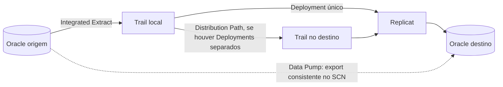

# OCI GoldenGate: Oracle Database para Oracle Database

Passo a passo para configurar **replicação contínua Oracle → Oracle** com o OCI GoldenGate Data Replication, da preparação dos bancos à validação dos dados.

> **Origem:** adaptação para GitHub do artigo [OCI GoldenGate: Oracle Database para Oracle Database](https://medium.com/@costa.cristiano/oci-goldengate-oracle-database-para-oracle-database-249184cd4ed1), de Cristiano Costa. Substitua os valores entre `<...>` pelos dados do seu ambiente e valide os comandos antes de executá-los em produção.

## Sumário

- [Arquitetura e sequência](#arquitetura-e-sequência)
- [1. Pré-requisitos](#1-pré-requisitos)
- [2. IAM](#2-iam)
- [3. Rede](#3-rede)
- [4. OCI Vault e secrets](#4-oci-vault-e-secrets)
- [5. Preparar o Oracle Database origem](#5-preparar-o-oracle-database-origem)
- [6. Preparar o Oracle Database destino](#6-preparar-o-oracle-database-destino)
- [7. Criar o Deployment](#7-criar-o-deployment)
- [8. Criar connections](#8-criar-connections)
- [9. Atribuir e testar connections](#9-atribuir-e-testar-connections)
- [10. Configurar a replicação](#10-configurar-a-replicação)
- [11. Carga inicial](#11-carga-inicial)
- [12. Operação e validação](#12-operação-e-validação)
- [Solução de problemas](#solução-de-problemas)
- [Referências](#referências)

## Arquitetura e sequência



O **Extract deve capturar as mudanças enquanto a linha de base é carregada**. Após a importação, o Replicat aplica as mudanças acumuladas e passa a acompanhar a origem. Um Deployment pode atender aos dois bancos em um cenário simples; avalie Deployments separados conforme volume, isolamento e disponibilidade.

Sequência completa: iniciar o Integrated Extract em um ponto coordenado → manter mudanças no trail → exportar e importar a linha de base no SCN consistente → entregar o trail ao destino, quando necessário → iniciar o Replicat após a carga inicial. O Distribution Path é necessário quando há Deployments separados.

## 1. Pré-requisitos

- Versões e níveis de patch dos bancos; confirme a compatibilidade com a versão do Deployment.
- Topologia de cada banco: non-CDB, CDB/PDB ou RAC.
- Host ou SCAN FQDN, porta e service name da origem e do destino.
- VCN, subnet privada, NSGs/Security Lists, DNS e rotas entre o GoldenGate e os bancos. Para bancos externos à VCN, verifique também DRG/LPG, VPN ou FastConnect e o caminho de retorno.
- Usuário dedicado ao GoldenGate, como `GGADMIN`, e os privilégios apropriados para captura e aplicação.
- Wallets para conexões que exigem TCPS/TLS.
- Schemas, tabelas, chaves primárias/únicas, tipos de dados e estratégia de carga inicial definidos.

Para RAC, prefira o SCAN FQDN ao IP de um nó e verifique as restrições da versão escolhida, especialmente para SCAN com TCPS/TLS.

## 2. IAM

O artigo usa o grupo padrão `Administrators`, sem prefixo do Identity Domain, e apresenta esta policy administrativa como referência:

```text
allow group Administrators to manage all-resources in tenancy
```

Essa policy é ampla. Restrinja os privilégios e o escopo quando o modelo de acesso da organização exigir. O serviço GoldenGate também precisa das policies a seguir para trabalhar com Vault, chaves e IAM Identity Domains:

```text
allow service goldengate to use keys in tenancy
allow service goldengate to use vaults in tenancy
allow service goldengate to {idcs_user_viewer, domain_resources_viewer} in tenancy
```

Para permitir a leitura de senhas e wallets armazenadas como secrets, acesse **Identity & Security → Dynamic Groups → Create Dynamic Group** e crie, por exemplo, `dg-ogg-deployments`. Use esta regra para os Deployments do compartment:

```text
ALL {resource.type = 'goldengatedeployment', resource.compartment.id = '<compartment-ocid>'}
```

Depois, conceda acesso aos bundles de secrets. O artigo usa o escopo da tenancy:

```text
allow dynamic-group dg-ogg-deployments to read secret-bundles in tenancy
```

Quando possível, restrinja a policy ao compartment que contém os secrets:

```text
allow dynamic-group dg-ogg-deployments to read secret-bundles in compartment <compartment-name>
```

Adapte os nomes e o escopo das policies à tenancy e ao Identity Domain utilizados.

## 3. Rede

Reserve uma subnet privada para o GoldenGate, por exemplo `10.0.10.0/24` em uma VCN `10.0.0.0/16`, sem sobreposição de CIDRs. Libere o tráfego necessário nos NSGs ou Security Lists:

| Tipo da connection | Origem do tráfego a liberar no banco |
| --- | --- |
| Shared endpoint | *Ingress IPs* do Deployment |
| Dedicated endpoint | *Ingress IPs* exibidos na connection |

Se os bancos estiverem on-premises ou em outra VCN, valide DRG/LPG, VPN/FastConnect, DNS e rotas de retorno.

## 4. OCI Vault e secrets

1. Acesse **Identity & Security → Vault → Create Vault**. Crie, por exemplo, `VAULT-OGG`, e aguarde o estado `Active`.
2. Abra o Vault e acesse **Master Encryption Keys → Create Key**. Crie uma chave AES, por exemplo `KEY-OGG-SECRETS`.
3. Crie secrets separados para cada finalidade:

   | Exemplo de secret | Conteúdo |
   | --- | --- |
   | `OGG-SRC-PASSWORD` | Senha do usuário GoldenGate na origem |
   | `OGG-TGT-PASSWORD` | Senha do usuário GoldenGate no destino |
   | `OGG-SRC-WALLET` | Wallet da origem, quando necessária |
   | `OGG-TGT-WALLET` | Wallet do destino, quando necessária |

No fluxo da connection, use **Create wallet secret** para enviar a wallet. O artigo indica `cwallet.sso` e `tnsnames.ora` como conteúdo mínimo. Não reutilize um secret de senha como secret de wallet.

## 5. Preparar o Oracle Database origem

Execute os comandos com uma conta DBA, após validá-los no processo de mudança da organização. Em CDB/PDB, defina o container correto e se o usuário será comum, como `C##GGADMIN`.

Verifique `ARCHIVELOG` e prepare o banco para captura:

```sql
ARCHIVE LOG LIST;

ALTER DATABASE FORCE LOGGING;
ALTER DATABASE ADD SUPPLEMENTAL LOG DATA;
ALTER SYSTEM SET enable_goldengate_replication=TRUE SCOPE=BOTH;
```

Exemplo inicial para uma base **non-CDB**:

```sql
CREATE USER ggadmin IDENTIFIED BY "<senha-segura>";
GRANT CREATE SESSION TO ggadmin;

BEGIN
  DBMS_GOLDENGATE_AUTH.GRANT_ADMIN_PRIVILEGE(
    grantee                 => 'GGADMIN',
    privilege_type          => 'CAPTURE',
    grant_select_privileges => TRUE,
    do_grants               => TRUE);
END;
/
```

Habilite `TRANDATA` para os schemas ou tabelas incluídos na replicação quando configurar o Extract.

## 6. Preparar o Oracle Database destino

Crie o usuário de aplicação das mudanças:

```sql
CREATE USER ggadmin IDENTIFIED BY "<senha-segura>";
GRANT CREATE SESSION TO ggadmin;

BEGIN
  DBMS_GOLDENGATE_AUTH.GRANT_ADMIN_PRIVILEGE(
    grantee                 => 'GGADMIN',
    privilege_type          => 'APPLY',
    grant_select_privileges => TRUE,
    do_grants               => TRUE);
END;
/
```

Confirme a compatibilidade dos schemas, tabelas, tipos de dados e chaves primárias/únicas entre origem e destino antes de iniciar o Replicat. Em CDB/PDB, ajuste usuário, privilégios e container conforme o desenho do ambiente.

## 7. Criar o Deployment

1. Na OCI Console, acesse **Oracle AI Database → GoldenGate → Deployments → Create deployment**.
2. Preencha os campos:

   | Campo | Valor |
   | --- | --- |
   | Deployment type | `Data replication` |
   | Technology | `Oracle Database` |
   | Version | Compatível com origem e destino |
   | Private subnet | `<subnet-golden-gate>` |
   | Credential store | OCI IAM ou GoldenGate |

3. Aguarde o estado `Active`. Registre a **Console URL**, os **Ingress IPs** e o endereço privado do Deployment.

Por padrão, o acesso à console é HTTPS na porta `443`. Habilite acesso público somente quando necessário e com regras de rede restritas.

## 8. Criar connections

Em **GoldenGate → Connections → Create connection**, crie uma connection para cada banco:

| Campo | Origem | Destino |
| --- | --- | --- |
| Nome | `OGG-SRC-ORACLE` | `OGG-TGT-ORACLE` |
| Tipo | Oracle Database | Oracle Database |
| Connection string | `<host-ou-scan>:<porta>/<service-name>` | `<host-ou-scan>:<porta>/<service-name>` |
| Usuário | `GGADMIN` | `GGADMIN` |
| Password secret | `OGG-SRC-PASSWORD` | `OGG-TGT-PASSWORD` |
| Wallet secret, se necessário | `OGG-SRC-WALLET` | `OGG-TGT-WALLET` |
| Network connectivity | Shared endpoint ou Dedicated endpoint | Shared endpoint ou Dedicated endpoint |

Crie e altere connections pela **OCI Console**, para manter as configurações sincronizadas com o Deployment. Evite editar credenciais diretamente na console interna do Deployment.

## 9. Atribuir e testar connections

1. Abra **GoldenGate → Deployments → `<deployment>` → Assigned connections**.
2. Clique em **Assign connection** e atribua as connections de origem e de destino.
3. No menu de ações de cada connection, selecione **Test connection**.
4. Confirme os dois resultados: **Network-level connectivity** (host e porta alcançáveis) e **Application-level connectivity** (credenciais e conexão Oracle válidas).

## 10. Configurar a replicação

Abra **Launch console** no Deployment. A ordem geral é **Extract → trail/Distribution Path → Replicat**:

### Origem

1. Crie um **Integrated Extract**.
2. Selecione a connection de origem.
3. Defina o ponto inicial da captura: hora atual, SCN específico ou um ponto planejado para a carga inicial.
4. Habilite `TRANDATA` nos schemas/tabelas necessários.
5. Configure o trail local.
6. Se o destino estiver em outro Deployment, crie um **Distribution Path** para entregar o trail.

#### Consultas auxiliares para o mapeamento da origem

Execute as consultas abaixo na origem, no container/PDB que contém os schemas a replicar. Elas listam schemas não mantidos pela Oracle que possuem objetos e excluem `GGADMIN`. Revise o resultado antes de usar os comandos gerados.

**Gerar comandos para adicionar `SCHEMATRANDATA` com `ALLCOLS`:**

```sql
SET PAGESIZE 1000 LINESIZE 1000

SELECT DISTINCT 'ADD SCHEMATRANDATA ' || owner || ' ALLCOLS' AS comando
FROM dba_objects
WHERE owner <> 'GGADMIN'
  AND owner IN (
    SELECT username
    FROM dba_users
    WHERE oracle_maintained = 'N'
  )
ORDER BY comando;
```

**Gerar linhas `TABLE` para os parâmetros do Extract:**

```sql
SET PAGESIZE 1000 LINESIZE 1000

SELECT DISTINCT 'TABLE ' || owner || '.*;' AS parametro_extract
FROM dba_objects
WHERE owner <> 'GGADMIN'
  AND owner IN (
    SELECT username
    FROM dba_users
    WHERE oracle_maintained = 'N'
  )
ORDER BY parametro_extract;
```

O resultado da primeira consulta deve ser executado no Admin Client do GoldenGate após `DBLOGIN`. As linhas da segunda consulta entram no arquivo de parâmetros do Extract. `ALLCOLS` amplia o logging suplementar; confirme quais schemas devem participar da replicação antes de aplicar os comandos.

#### Opção de parâmetros para o Integrated Extract

Exemplo para capturar DML e DDL dos schemas selecionados. Substitua os nomes do Extract, do alias, do trail e dos schemas pelos valores do ambiente:

```text
EXTRACT EAPP01
USERIDALIAS conn-orclsrc
EXTTRAIL ea

REPORTCOUNT EVERY 10 MINUTES, RATE
REPORT AT 09:00

DDL INCLUDE MAPPED
DDLOPTIONS REPORT

LOGALLSUPCOLS
TABLE XXX.*;
TABLE XX11.*;
```

| Parâmetro | O que faz |
| --- | --- |
| `REPORTCOUNT EVERY 10 MINUTES, RATE` | Registra a quantidade de operações processadas a cada 10 minutos e as taxas total e desde o último relatório. Pode não emitir uma linha exatamente no intervalo se não houver registros processados. |
| `REPORT AT 09:00` | Acrescenta estatísticas de execução ao relatório do processo diariamente às 09:00; não substitui nem apaga o relatório. Confirme o fuso horário usado pelo Deployment. |
| `DDL INCLUDE MAPPED` | Captura as DDLs suportadas para objetos no escopo mapeado pelas linhas `TABLE`. A aplicação da DDL no destino também depende da configuração do Replicat. |
| `DDLOPTIONS REPORT` | Acrescenta ao relatório detalhes das etapas de processamento de DDL, úteis para diagnóstico. |
| `LOGALLSUPCOLS` | Inclui no trail as imagens anteriores das colunas com logging suplementar necessárias, por exemplo para dependências do Integrated/Parallel Replicat. O parâmetro é o padrão nas versões atuais, mas pode ser declarado explicitamente. Não cria o `TRANDATA`; configure-o antes. |
| `TABLE XXX.*;` e `TABLE XX11.*;` | Selecionam todas as tabelas desses dois schemas para captura. Troque `XXX` e `XX11` pelos schemas reais e confira que eles têm `SCHEMATRANDATA`. |

**Fuso da origem, somente se necessário:** para Integrated Extract em Oracle, se o sistema operacional do banco de origem e o processo Extract usam fusos diferentes, acrescente a linha abaixo ao arquivo de parâmetros. O valor deve corresponder ao fuso do **sistema operacional da origem**, não ser deduzido apenas de `DBTIMEZONE` ou `SESSIONTIMEZONE`:

```text
TRANLOGOPTIONS SOURCE_OS_TIMEZONE GMT-03:00
```

**Alternativa para `TRUNCATE TABLE` sem captura completa de DDL:** use `GETTRUNCATES` antes das linhas `TABLE` se quiser capturar truncamentos de forma independente, sem `DDL INCLUDE MAPPED` para essas mesmas tabelas. O efeito continua para as linhas `TABLE` seguintes. Configure o Replicat para processar truncamentos conforme a topologia.

```text
GETTRUNCATES
TABLE XXX.*;
TABLE XX11.*;
```

Não habilite `GETTRUNCATES` junto com a captura de DDL que já inclui `TRUNCATE` para as mesmas tabelas: a Oracle documenta o erro `OGG-00506` e recomenda escolher apenas um mecanismo. O suporte autônomo de `GETTRUNCATES` também tem limitações para tabelas/partições vazias; valide esse caso antes de usá-lo.

Referências dos parâmetros: [REPORTCOUNT](https://docs.oracle.com/en/database/goldengate/core/26/reference/reportcount.html), [REPORT](https://docs.oracle.com/en/database/goldengate/core/26/reference/report.html), [DDL](https://docs.oracle.com/en/database/goldengate/core/26/reference/ddl.html), [DDLOPTIONS](https://docs.oracle.com/en/database/goldengate/core/26/reference/ddloptions.html), [LOGALLSUPCOLS](https://docs.oracle.com/en/database/goldengate/core/26/reference/logallsupcols.html), [GETTRUNCATES e DDL](https://docs.oracle.com/en/database/goldengate/core/26/coredoc/extract-oracle-truncates.html) e [SOURCE_OS_TIMEZONE](https://docs.oracle.com/en/database/goldengate/core/26/reference/tranlogoptions.html).

### Destino

1. Crie um **Replicat**.
2. Selecione a connection de destino.
3. Selecione o trail local ou recebido, conforme a topologia.
4. Defina o mapeamento de schemas e tabelas.
5. Inicie o Replicat **somente após** concluir a carga inicial, no ponto de aplicação alinhado ao SCN da linha de base.

As opções da interface variam entre versões do GoldenGate. Para Deployments separados, configure também o acesso do Deployment de origem ao Receiver Service do destino.

#### Opção de parâmetros para o Replicat

Exemplo para aplicar DML e truncamentos capturados pela alternativa `GETTRUNCATES` do Extract. Ajuste o nome do Replicat e o alias de destino; habilite a filtragem de instanciação somente após validar os CSNs por tabela da carga inicial.

```text
REPLICAT RAPP01
USERIDALIAS conn-orcltgt

-- Opcional: somente com estruturas idênticas e trail sem definições
-- ASSUMETARGETDEFS

GETTRUNCATES
DBOPTIONS ENABLE_INSTANTIATION_FILTERING
REPERROR (DEFAULT, ABEND)

-- Opcional: excluir apenas os objetos definidos no escopo da replicação
-- MAPEXCLUDE XXX.TABELA_EXCLUIDA;

MAP XXX.*, TARGET XXX.*;
MAP XX11.*, TARGET XX11.*;
```

| Parâmetro | O que faz |
| --- | --- |
| `ASSUMETARGETDEFS` | Assume que as estruturas de colunas da origem e do destino são idênticas e usa as definições do destino. É uma opção para trails antigos sem metadados de tabelas. Em trails com definições, os metadados do trail prevalecem e esse parâmetro normalmente é ignorado (`OGG-02760`). Não acrescente `OVERRIDE` sem avaliar as estruturas. |
| `GETTRUNCATES` | Aplica no destino as operações de truncamento recebidas no trail. Deve preceder os `MAP` aos quais se aplica; depende de o Extract capturar esses truncamentos. |
| `DBOPTIONS ENABLE_INSTANTIATION_FILTERING` | Habilita a filtragem por CSN de instanciação de cada tabela no Oracle destino, evitando reaplicar alterações já incluídas na carga inicial. Exige CSNs corretos registrados no destino; o parâmetro sozinho não cria esses pontos de corte. |
| `REPERROR (DEFAULT, ABEND)` | Define que erros de aplicação sem uma regra específica provocam rollback da transação afetada e encerramento anormal do Replicat. Corrija a causa antes de reiniciar. |
| `TABLEEXCLUDE XXX.*;` | É um parâmetro do **Extract**: exclui todas as tabelas desse schema da captura. No Replicat, use `MAPEXCLUDE` para expressar exclusões de objetos da origem. |
| `MAPEXCLUDE XXX.TABELA_EXCLUIDA;` | Exclui a tabela indicada da aplicação, mesmo que ela corresponda a um `MAP` com curinga. O exemplo está comentado para ser ativado somente quando houver uma exclusão planejada. |
| `MAP XXX.*, TARGET XXX.*;` | Mapeia as tabelas capturadas do schema `XXX` para tabelas de mesmo nome no schema `XXX` do destino. Repita o mapeamento para cada schema incluído no Extract, como `XX11`. |

**Correspondência com o Extract:** os objetos à esquerda de `MAP` devem corresponder aos incluídos nas linhas `TABLE` do Extract. Neste procedimento, preservando os nomes dos schemas e tabelas, `TARGET` usa os mesmos nomes. Se o destino tiver outro schema, ajuste o lado `TARGET`, por exemplo `MAP XXX.*, TARGET NOVO_SCHEMA.*;`. Em CDB/PDB, ajuste também a qualificação do container da origem quando o trail usar nomes em três partes.

As exclusões devem seguir o mesmo escopo planejado na origem: `TABLEEXCLUDE` no Extract corresponde a `MAPEXCLUDE` no Replicat. Objetos excluídos da captura não chegam ao trail. **Não copie `XXX.*` como exclusão se deseja replicar esse schema:** `MAPEXCLUDE XXX.*;` elimina todas as tabelas de `MAP XXX.*, TARGET XXX.*;`.

**Validação da instanciação:** confirme que o Data Pump registrou os CSNs no destino após preparar as tabelas na origem com `TRANDATA/SCHEMATRANDATA PREPARECSN`, ou registre o CSN de cada tabela com `SET INSTANTIATION CSN` no Admin Client após `DBLOGIN`. Os valores precisam representar a carga inicial efetivamente importada. Confira os metadados em `DBA_APPLY_INSTANTIATED_OBJECTS` e as mensagens de instanciação no relatório do Replicat. Isso deve ser coordenado com o ponto de início do Replicat descrito na carga inicial.

**Se usar a opção de captura de DDL do Extract:** configure também a aplicação de DDL no Replicat, por exemplo `DDL INCLUDE MAPPED` e `DDLOPTIONS REPORT`, conforme o escopo escolhido. `GETTRUNCATES` não habilita a aplicação geral de DDL; use o mecanismo de truncamento correspondente à configuração da origem.

Referências: [ASSUMETARGETDEFS](https://docs.oracle.com/en/database/goldengate/core/26/reference/assumetargetdefs.html), [GETTRUNCATES](https://docs.oracle.com/en/database/goldengate/core/26/reference/gettruncates-ignoretruncates.html), [DBOPTIONS](https://docs.oracle.com/en/database/goldengate/core/26/reference/dboptions.html), [SET INSTANTIATION CSN](https://docs.oracle.com/en/database/goldengate/core/26/gclir/set-instantiation-csn.html), [REPERROR](https://docs.oracle.com/en/database/goldengate/core/26/reference/reperror.html), [TABLEEXCLUDE](https://docs.oracle.com/en/database/goldengate/core/26/reference/tableexclude.html) e [MAPEXCLUDE](https://docs.oracle.com/en/database/goldengate/core/26/reference/mapexclude.html).

## 11. Carga inicial

O artigo propõe Data Pump como uma das estratégias de carga inicial. Também são possíveis Extract de carga inicial, ferramenta externa ou início em SCN definido quando os dados já estão sincronizados.

Não inicie a aplicação contínua sem definir como a linha de base e o ponto de início da captura serão coordenados.

Para a estratégia com Data Pump:

1. Configure e inicie o Extract de modo que as alterações sejam retidas no trail.
2. Registre o SCN atual da **origem**:

   ```sql
   SELECT current_scn FROM v$database;
   ```

3. Use esse mesmo valor no **Export** para obter uma linha de base consistente:

   ```text
   FLASHBACK_SCN=<scn-da-origem>
   ```

4. Importe os dados no destino e confirme a conclusão da carga.
5. Alinhe o ponto de aplicação do Replicat ao SCN da linha de base e só então inicie o processo.

> **Ponto crítico:** `FLASHBACK_SCN` é usado no **Export** (`expdp`) desta estratégia. Planeje em conjunto o SCN do Export, o início do Extract e o posicionamento do Replicat. Uma divergência pode causar lacunas ou reaplicação de mudanças. Garanta também retenção de redo/archived logs e espaço para o trail durante a carga.

## 12. Operação e validação

No Admin Client, consulte os processos e as mensagens:

```text
INFO ALL
VIEW MESSAGES
```

Confira:

| Item | Resultado esperado |
| --- | --- |
| Extract | `RUNNING` |
| Replicat | `RUNNING` |
| Lag | Dentro do SLA definido |
| Mensagens | Sem erros pendentes em `VIEW MESSAGES` |
| Dados | Alterações refletidas no destino |

Faça um teste controlado de `INSERT`, `UPDATE` e `DELETE` na origem e confirme cada alteração no destino. Verifique também se a linha de base e as mudanças posteriores ao SCN não geraram lacunas nem duplicidade.

## Solução de problemas

| Sintoma | Verificações iniciais |
| --- | --- |
| Connection falha no teste de rede | Host/SCAN, porta, DNS, rotas, NSG/Security List e *Ingress IPs* do endpoint escolhido |
| Connection falha no teste de aplicação | Service name, usuário, password secret, wallet/TCPS e privilégios no banco |
| Deployment não lê secrets | Regra do dynamic group, compartment do Deployment e policy `read secret-bundles` no local dos secrets |
| Extract não captura alterações | `ARCHIVELOG`, logging adicional, parâmetro GoldenGate, `TRANDATA`, privilégios e ponto inicial |
| Replicat apresenta erros ou dados divergentes | Importação inicial, SCN, trail, mapeamento, compatibilidade dos objetos e mensagens do processo |
| Lag acima do SLA | Volume de alterações, entrega do trail, rede, capacidade dos Deployments e desempenho do destino |

Use as mensagens e os relatórios dos processos para identificar a causa antes de reiniciar ou reposicionar Extract/Replicat.

## Referências

- [Artigo original — Cristiano Costa](https://medium.com/@costa.cristiano/oci-goldengate-oracle-database-para-oracle-database-249184cd4ed1)
- [OCI GoldenGate: recursos de replicação de dados](https://docs.oracle.com/en/cloud/paas/goldengate-service/ocigg/create-data-replication-resources.html)
- [OCI GoldenGate: policies](https://docs.oracle.com/en/cloud/paas/goldengate-service/ocigg/oracle-cloud-infrastructure-goldengate-policies.html)
- [OCI GoldenGate: atribuir e testar connections](https://docs.oracle.com/en/cloud/paas/goldengate-service/ocigg/manage-deployments.html)
- [OCI GoldenGate: Distribution Path](https://docs.oracle.com/en/cloud/paas/goldengate-service/ocigg/replicate/add-a-distribution-path.html)
- [Oracle GoldenGate: `ADD SCHEMATRANDATA`](https://docs.oracle.com/en/database/goldengate/core/26/gclir/add-schematrandata.html)
- [Oracle Data Pump Export: parâmetro `FLASHBACK_SCN`](https://docs.oracle.com/en/database/oracle/oracle-database/19/sutil/oracle-data-pump-export-utility.html)
