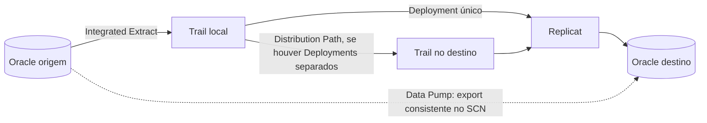

# OCI GoldenGate: Oracle Database para Oracle Database

Guia de referência para configurar **replicação contínua Oracle → Oracle** com o OCI GoldenGate Data Replication. Ele cobre a preparação dos bancos, IAM, rede, Vault, conexões, carga inicial e validação.

> **Origem:** adaptação para GitHub do artigo [OCI GoldenGate: Oracle Database para Oracle Database](https://medium.com/@costa.cristiano/oci-goldengate-oracle-database-para-oracle-database-249184cd4ed1), de Cristiano Costa. Substitua os valores entre `<...>` pelos dados do seu ambiente e valide os comandos antes de executá-los em produção.

## Sumário

- [Arquitetura e sequência](#arquitetura-e-sequência)
- [Pré-requisitos](#pré-requisitos)
- [1. Configurar IAM, rede e Vault](#1-configurar-iam-rede-e-vault)
- [2. Preparar os bancos Oracle](#2-preparar-os-bancos-oracle)
- [3. Criar o Deployment e as connections](#3-criar-o-deployment-e-as-connections)
- [4. Configurar Extract e Replicat](#4-configurar-extract-e-replicat)
- [5. Coordenar a carga inicial com SCN](#5-coordenar-a-carga-inicial-com-scn)
- [6. Validar e monitorar](#6-validar-e-monitorar)
- [Referências](#referências)

## Arquitetura e sequência



O **Extract deve capturar as mudanças enquanto a linha de base é carregada**. Após a importação, o Replicat aplica as mudanças acumuladas e passa a acompanhar a origem. Um Deployment pode atender aos dois bancos em um cenário simples; avalie Deployments separados conforme volume, isolamento e disponibilidade.

## Pré-requisitos

- Versões e níveis de patch dos bancos; confirme a compatibilidade com a versão do Deployment.
- Topologia de cada banco: non-CDB, CDB/PDB ou RAC.
- Host ou SCAN FQDN, porta e service name da origem e do destino.
- VCN, subnet privada, NSGs/Security Lists, DNS e rotas entre o GoldenGate e os bancos. Para bancos externos à VCN, verifique também DRG/LPG, VPN ou FastConnect e o caminho de retorno.
- Usuário dedicado ao GoldenGate, como `GGADMIN`, e os privilégios apropriados para captura e aplicação.
- Wallets para conexões que exigem TCPS/TLS.
- Schemas, tabelas, chaves primárias/únicas, tipos de dados e estratégia de carga inicial definidos.

## 1. Configurar IAM, rede e Vault

### IAM

O artigo usa o grupo padrão `Administrators` e apresenta estas policies de serviço como referência:

```text
allow service goldengate to use keys in tenancy
allow service goldengate to use vaults in tenancy
allow service goldengate to {idcs_user_viewer, domain_resources_viewer} in tenancy
```

Para permitir a leitura de senhas e wallets armazenadas como secrets, crie um dynamic group para os Deployments do compartment:

```text
ALL {resource.type = 'goldengatedeployment', resource.compartment.id = '<compartment-ocid>'}
```

Depois, conceda acesso aos bundles de secrets:

```text
allow dynamic-group dg-ogg-deployments to read secret-bundles in compartment <compartment-name>
```

> Ajuste o escopo e os nomes das policies ao modelo de IAM da organização. A policy administrativa `manage all-resources in tenancy` mostrada no artigo é ampla; use-a somente se esse nível de acesso já fizer parte do desenho aprovado para o ambiente.

### Rede

Reserve uma subnet privada para o GoldenGate, por exemplo `10.0.10.0/24` em uma VCN `10.0.0.0/16`, sem sobreposição de CIDRs. Libere o tráfego necessário nos NSGs ou Security Lists:

| Tipo da connection | Origem do tráfego a liberar no banco |
| --- | --- |
| Shared endpoint | *Ingress IPs* do Deployment |
| Dedicated endpoint | *Ingress IPs* exibidos na connection |

### Vault e secrets

Crie um Vault, uma chave AES e secrets separados para cada finalidade:

| Exemplo de secret | Conteúdo |
| --- | --- |
| `OGG-SRC-PASSWORD` | Senha do usuário GoldenGate na origem |
| `OGG-TGT-PASSWORD` | Senha do usuário GoldenGate no destino |
| `OGG-SRC-WALLET` | Wallet da origem, quando necessária |
| `OGG-TGT-WALLET` | Wallet do destino, quando necessária |

No fluxo da connection, use **Create wallet secret** para enviar a wallet. O artigo indica `cwallet.sso` e `tnsnames.ora` como conteúdo mínimo. Não reutilize um secret de senha como secret de wallet.

## 2. Preparar os bancos Oracle

Execute os comandos com uma conta DBA e adapte-os ao tipo e à versão do banco. Em CDB/PDB, defina o container correto e se o usuário será comum, como `C##GGADMIN`.

### Origem

Verifique `ARCHIVELOG` e prepare o banco para captura:

```sql
ARCHIVE LOG LIST;

ALTER DATABASE FORCE LOGGING;
ALTER DATABASE ADD SUPPLEMENTAL LOG DATA;
ALTER SYSTEM SET enable_goldengate_replication=TRUE SCOPE=BOTH;
```

Exemplo inicial para uma base **non-CDB**:

```sql
CREATE USER ggadmin IDENTIFIED BY "<senha-segura>";
GRANT CREATE SESSION TO ggadmin;

BEGIN
  DBMS_GOLDENGATE_AUTH.GRANT_ADMIN_PRIVILEGE(
    grantee                 => 'GGADMIN',
    privilege_type          => 'CAPTURE',
    grant_select_privileges => TRUE,
    do_grants               => TRUE);
END;
/
```

### Destino

Crie o usuário de aplicação das mudanças:

```sql
CREATE USER ggadmin IDENTIFIED BY "<senha-segura>";
GRANT CREATE SESSION TO ggadmin;

BEGIN
  DBMS_GOLDENGATE_AUTH.GRANT_ADMIN_PRIVILEGE(
    grantee                 => 'GGADMIN',
    privilege_type          => 'APPLY',
    grant_select_privileges => TRUE,
    do_grants               => TRUE);
END;
/
```

Confirme a compatibilidade dos objetos e das chaves entre origem e destino antes de iniciar o Replicat.

## 3. Criar o Deployment e as connections

1. Na OCI Console, acesse **Oracle AI Database → GoldenGate → Deployments → Create deployment**.
2. Escolha **Data replication**, tecnologia **Oracle Database**, versão compatível com ambos os bancos e a subnet privada preparada.
3. Aguarde o estado `Active`. Registre a URL da console, os *Ingress IPs* e o endereço privado do Deployment.
4. Em **GoldenGate → Connections → Create connection**, crie uma connection para cada banco:

| Campo | Origem | Destino |
| --- | --- | --- |
| Nome | `OGG-SRC-ORACLE` | `OGG-TGT-ORACLE` |
| Tipo | Oracle Database | Oracle Database |
| Connection string | `<host-ou-scan>:<porta>/<service-name>` | `<host-ou-scan>:<porta>/<service-name>` |
| Usuário | `GGADMIN` | `GGADMIN` |
| Password secret | `OGG-SRC-PASSWORD` | `OGG-TGT-PASSWORD` |
| Wallet secret, se necessário | `OGG-SRC-WALLET` | `OGG-TGT-WALLET` |

5. Em **Deployment → Assigned connections**, atribua as duas connections e execute **Test connection** em cada uma. Verifique tanto a conectividade de rede quanto a autenticação no Oracle.

Crie e altere connections pela **OCI Console**, para manter as configurações sincronizadas com o Deployment. Restrinja o acesso público à console do GoldenGate quando ele for necessário.

## 4. Configurar Extract e Replicat

Abra **Launch console** no Deployment e siga a sequência:

1. Crie um **Integrated Extract** associado à connection de origem.
2. Defina o ponto de início da captura, habilite `TRANDATA` nos objetos necessários e configure o trail local.
3. Se usar Deployments separados, configure o **Distribution Path** para entregar o trail ao destino.
4. Crie o **Replicat**, selecione a connection de destino, o trail correspondente e os mapeamentos de schemas/tabelas.
5. Inicie o Replicat **após** terminar a carga inicial coordenada com o ponto de captura.

## 5. Coordenar a carga inicial com SCN

O artigo propõe Data Pump como uma das estratégias de carga inicial. Também são possíveis Extract de carga inicial, ferramenta externa ou início em SCN definido quando os dados já estão sincronizados.

Para a estratégia com Data Pump:

1. Configure e inicie o Extract de modo que as alterações sejam retidas no trail.
2. Registre o SCN atual da **origem**:

   ```sql
   SELECT current_scn FROM v$database;
   ```

3. Use esse mesmo valor no **Export** para obter uma linha de base consistente:

   ```text
   FLASHBACK_SCN=<scn-da-origem>
   ```

4. Importe os dados no destino, confirme a conclusão da carga e só então inicie o Replicat no ponto de aplicação alinhado ao SCN.

> **Ponto crítico:** planeje em conjunto o SCN do Export, o início do Extract e o posicionamento do Replicat. Uma divergência pode causar lacunas ou reaplicação de mudanças.

## 6. Validar e monitorar

No Admin Client, consulte os processos e as mensagens:

```text
INFO ALL
VIEW MESSAGES
```

Confira se Extract e Replicat estão em `RUNNING`, se o lag atende ao SLA e se não há erros. Faça um teste controlado de `INSERT`, `UPDATE` e `DELETE` na origem e confirme cada alteração no destino.

## Referências

- [Artigo original — Cristiano Costa](https://medium.com/@costa.cristiano/oci-goldengate-oracle-database-para-oracle-database-249184cd4ed1)
- [OCI GoldenGate: recursos de replicação de dados](https://docs.oracle.com/en/cloud/paas/goldengate-service/ocigg/create-data-replication-resources.html)
- [OCI GoldenGate: atribuir e testar connections](https://docs.oracle.com/en/cloud/paas/goldengate-service/ocigg/manage-deployments.html)
- [Oracle Data Pump Export: parâmetro `FLASHBACK_SCN`](https://docs.oracle.com/en/database/oracle/oracle-database/19/sutil/oracle-data-pump-export-utility.html)
